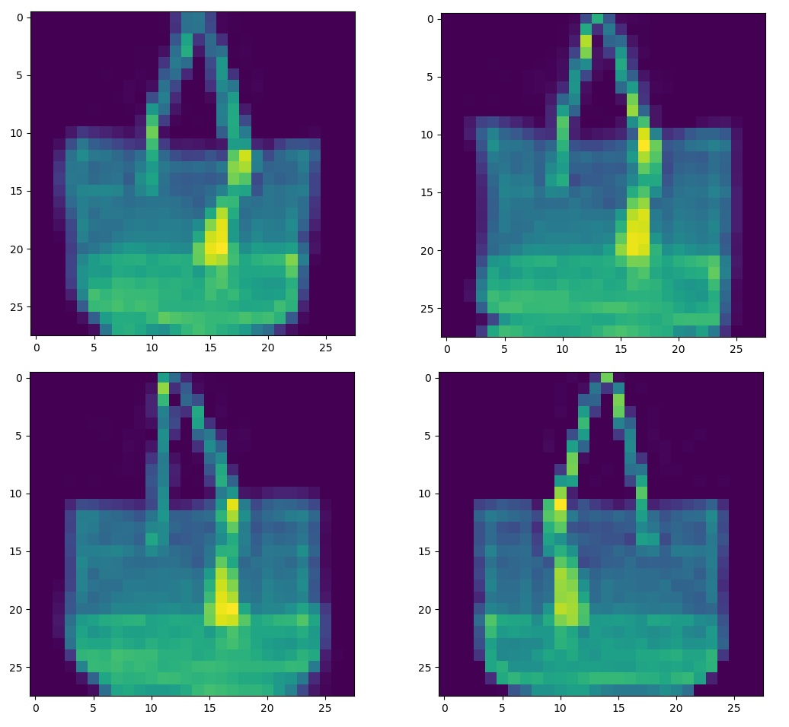

# Fashion-mnist ML models

This repository contains a couple of ML models trained for image classification on the fashion-mnist dataset.

# Methods 

## Testing previous models - KNN

Choosing from the models implemented during previous classes I've decided to use
a KNN classifier, which should perform well on an image classification task.
It can be found in the knn.py file. I had to modify the distance function so that it fits
new data - it's a simple Euclidean distance function, the weights are uniform. There's no image 
preprocessing/feature extraction apart from normalization, 
they are treated as 28x28 matrices and supplied to the distance function in this format.
This model is similar to the model from the benchmark site:

> KNeighborsClassifier {"n_neighbors":5,"p":2,"weights":"uniform"}, accuracy: 0.851  

### Results

I tested the k-value on a limited set of 10,000 train images and 2,000 validation images
and decided to go with k = 5 for the full-size test (actually half-size, because neither my laptop, nor Google Colab could 
handle it in this form, because of high RAM usage). The results obtained are as follows (accuracy):

10k train/2k validation:

- 0.793 for k=50
- 0.822 for k=9
- 0.823 for k=5
- 0.820 for k=3
- 0.808 for k=1

And for the 30k train/5k test:

- 0.839 for k=5

That corresponds to the official benchmark - 0.851 accuracy when using a full set - and I believe it would get there
with that number of training data, so it seems to work just fine.

## Better model - CNN

For my go-to model I've chosen a convolutional neural network, which is also well suited for an image 
classification task. Inspired by a [paper](https://www.cs.cmu.edu/~bhiksha/courses/deeplearning/Fall.2016/pdfs/Simard.pdf) 
on a cnn & elastic distortions usage for the original mnist dataset I started with a similar simple 
architecture (at first without distortions) - 2 convolution layers and one dense layer. The training set was divided into
a 50,000 training set and a 10,000 validation set. After 100 epochs of training the model achieved 99,5% accuracy on the training set, but only
89% on the validation set. In fact the maximum (validation) accuracy was obtained just after 10 epochs
and it didn't change much after. To prevent overfitting I increased the number of parameters, added more convolutions, one dense layer
and dropout layers. Next thing to do was to augment the dataset, as described in the paper 
mentioned earlier. I used elastic distortions from [here](https://www.kaggle.com/babbler/mnist-data-augmentation-with-elastic-distortion). 
They aren't as common as affine transformations (maybe because they are not implemented in Keras), but work really well. 
I also tested random horizontal flips. The dataset has been augmented 3 times, which gives 200,000 training images in total
(the validation set wasn't augmented). The effect of the augmentation (and the flip I eventually didn't use) looks 
like this (original image is in the bottom right corner):



From there I've been performing tests and tweaking the model. For example, I found that the Adamax optimizer with default settings 
performs better than the RMSprop I've been using all the time. The final results are discussed below.

### Results

The results obtained for the network are much better, than for KNN. Training time is shorter as well. Having tuned the model
I merged the train and validation set again and used it for the final training. The model achieves accuracy:

- 0.989 on the training set
- 0.946 on the validation set (last epoch)
- **0.947 on the test set** (trained on full training+validation set)

This is a better result than for all of the standard CNNs listed in the benchmark section of the fashion-mnist repository.
In my opinion it shows that dataset augmentation is indeed a vital part of training a model when having a relatively small dataset. 
The model is very similar to other CNN models and this is the main difference between them.

# Usage 

Everything can be run by running the main.py file. Tensorflow/Kreas, numpy and scipy
are needed. I used Python 3.7 Anaconda distribution. The fashion-mnist set is included with Keras, 
so no additional downloading is necessary. KNN model can't be downloaded, but CNN model is available for download 
form the trained_model folder, in a .h5 Keras format. It can be used with code like this:
```python
from tensoflow import keras

(train_images, train_labels), (test_images, test_labels) = fashion_mnist.load_data()

test_images = (test_images / 255).reshape(len(test_images), 28, 28, 1)
test_labels = keras.utils.to_categorical(test_labels)

model = keras.models.load_model('trained_model/model.h5')
model.evaluate(test_images, test_labels, verbose=2)
```